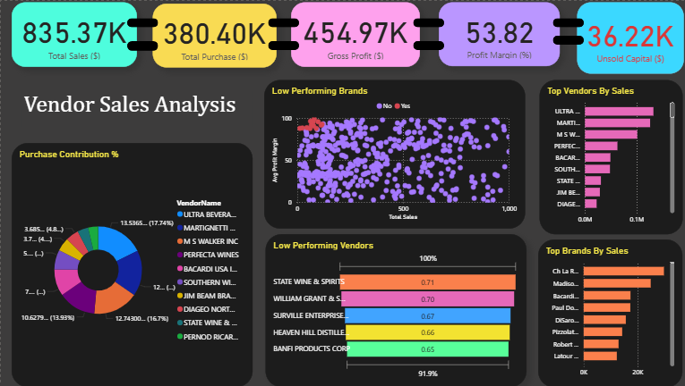
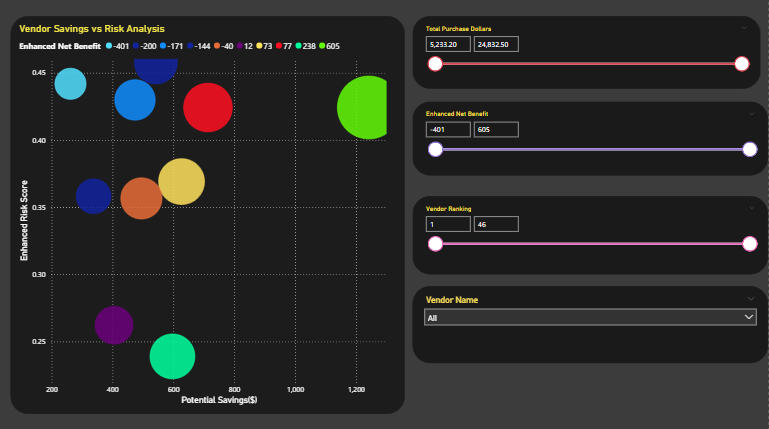

# 🧾 Vendor Performance Analysis – Retail Inventory & Sales

_Analyzing vendor efficiency and profitability to support strategic purchasing and inventory decisions using SQL, Python, and Power BI._

---

##  Table of Contents
- <a href="#overview">Overview</a>
- <a href="#business-problem">Business Problem</a>
- <a href="#dataset">Dataset</a>
- <a href="#tools--technologies">Tools & Technologies</a>
- <a href="#project-structure">Project Structure</a>
- <a href="#data-cleaning--preparation">Data Cleaning & Preparation</a>
- <a href="#exploratory-data-analysis-eda">Exploratory Data Analysis (EDA)</a>
- <a href="#research-questions--key-findings">Research Questions & Key Findings</a>
- <a href="#dashboard">Dashboard</a>

- <a href="#recommendations">Recommendations</a>
- <a href="#contact">Contact</a>

---
<h2><a class="anchor" id="overview"></a>Overview</h2>

This project evaluates vendor performance and retail inventory dynamics to drive strategic insights for purchasing, pricing, and inventory optimization. A complete data pipeline was built using SQL for ETL, Python for analysis and hypothesis testing, and Power BI for visualization.

---
<h2><a class="anchor" id="business-problem"></a>Business Problem</h2>

Effective inventory and sales management are critical in the retail sector. This project aims to:
- Identify underperforming brands needing pricing or promotional adjustments
- Identify vendors and brands that demonstrate the highest sales performance
- Determine vendor contributions to sales and profits
- Analyze the cost-benefit of bulk purchasing
- Investigate inventory turnover inefficiencies
- Statistically validate differences in vendor profitability
- Identify top vendors providing enhanced net benefit by determining risk score depending on ranking based on profit margin

---
<h2><a class="anchor" id="dataset"></a>Dataset</h2>

- Multiple CSV files located in Kaggle Inventory Analysis Casestudy dataset (sales, vendors, inventory)
- Summary table created from ingested data and used for analysis

---

<h2><a class="anchor" id="tools--technologies"></a>Tools & Technologies</h2>

- SQL (Common Table Expressions, Joins, Filtering)
- Python (Pandas, Matplotlib, Seaborn, SciPy)
- Power BI (Interactive Visualizations)
- GitHub

---
<h2><a class="anchor" id="project-structure"></a>Project Structure</h2>

```
vendor-performance-analysis/
│
├── README.md
├── .gitignore
├── requirements.txt
├── Vendor Performance Report.pdf
│
├── notebooks/                  # Jupyter notebooks
│   ├── exploratory_data_analysis.ipynb
│   ├── vendor_performance_analysis.ipynb
│
├── scripts/                    # Python scripts for ingestion and processing
│   ├── ingestion_db.py
│   └── get_vendor_summary.py
│
├── dashboard/                  # Power BI dashboard file
│   └── vendor_performance_dashboard.pbix
```

---
<h2><a class="anchor" id="data-cleaning--preparation"></a>Data Cleaning & Preparation</h2>

- Removed transactions with:
  - Gross Profit ≤ 0
  - Profit Margin ≤ 0
  - Sales Quantity = 0
- Created summary tables with vendor-level metrics
- Converted data types, handled outliers, merged lookup tables
- Ranked vendors based on total sales dollars, gross profit, profit margin and stock turnover

---
<h2><a class="anchor" id="exploratory-data-analysis-eda"></a>Exploratory Data Analysis (EDA)</h2>

**Negative or Zero Values Detected:**
- Gross Profit: Min -52,002.78 (loss-making sales)
- Profit Margin: Min -∞ (sales at zero or below cost)
- Unsold Inventory: Indicating slow-moving stock

**Outliers Identified:**
- Huge variation, from 0.09 to 257,032.07, suggests logistics inefficiencies or bulk shipments.
- Large Purchase/Actual Prices, max values (5,681.81 & 7,499.99) are significantly higher than the mean (24.39 & 35.64)

**Correlation Analysis:**
- Weak negative correlation between Vendor Ranking and Gross Profit (-0.04).
- Strong between Purchase Qty & Sales Qty (0.9)
- Moderate Negative between Profit Margin & Sales Price (-0.59)
- Weak negative correlation between Stock Turnover vs Gross Profit (-0.04)

---
<h2><a class="anchor" id="research-questions--key-findings"></a>Research Questions & Key Findings</h2>

1. **Brands for Promotions**: 13 brands with low sales but high profit margins
2. **Top Vendors**: Top 10 vendors = 76.33% of purchases → risk of over-reliance
3. **Bulk Purchasing Impact**: 67.57% cost savings per unit in large orders
4. **Inventory Turnover**: $36.22k worth of unsold inventory
5. **Vendor Profitability**:
   - High Vendors: Mean Margin = 57.08
   - Low Vendors: Mean Margin = 50.66
6. **Hypothesis Testing**: Statistically significant difference in profit margins → distinct vendor strategies
7. **Vendor consolidation**: Top vendors have significantly higher profit margins on average than low-performing vendors, as their confidence intervals do not overlap much.
8. **Low-Performing Vendors**:Their low sales volume might indicate a need for better marketing, competitive pricing, or improved distribution strategies

---
<h2><a class="anchor" id="dashboard"></a>Dashboard</h2>

- Power BI Dashboard shows:
  - Vendor-wise Sales and Margins
  - Inventory Turnover
  - Bulk Purchase Savings
  - Performance Heatmaps
  - Vendor savings vs Risk Analysis scatter chart





---

<h2><a class="anchor" id="recommendations"></a>Recommendations</h2>

- Diversify vendor base to reduce risk
- Optimize bulk order strategies
- Reprice slow-moving, high-margin brands
- Clear unsold inventory strategically
- Improve marketing for underperforming vendors
-  Focus more on top-performing vendors or investigate factors causing low profit margins in lower-performing vendors.

---
<h2><a class="anchor" id="contact"></a>Contact</h2>

**Khushi Gouda**

📧 Email: khushiriyadh@gmail.com  
🔗 [LinkedIn](https://www.linkedin.com/in/khushi-s-84b08b28b/)  

